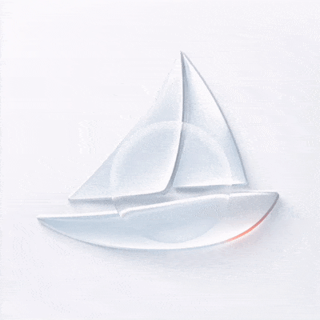
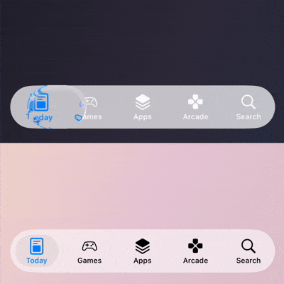
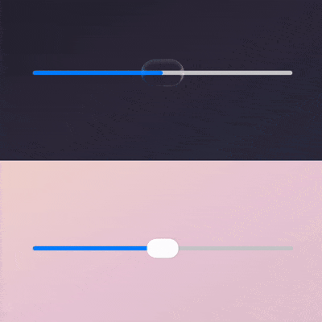
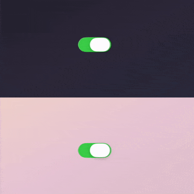
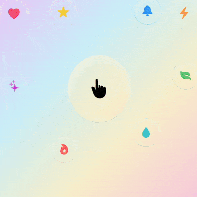
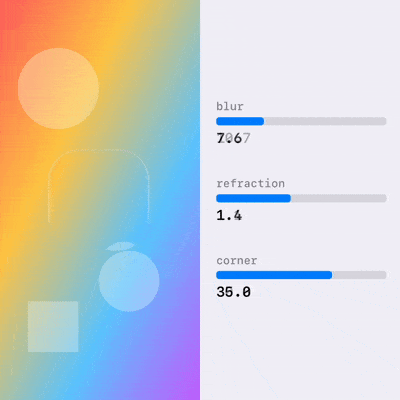
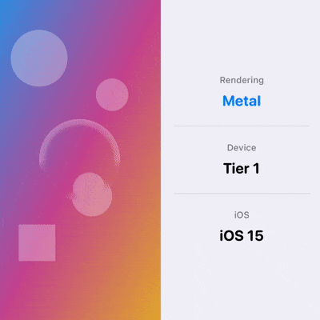

<h1 align="center">Theseus</h1>
<p align="center">
  <a href="https://drobinin.com/apps/theseus">
    
  </a>
</p>

<p align="center">
  <strong>iOS 26 Liquid Glass effects – backported to iOS 13+</strong>
</p>

<p align="center">
  
  
  
  
</p>

---

## What is Theseus?

Theseus gives you translucent UI components with blur, refraction, glare, and spring animations – the iOS 26 look, backported to iOS 13+. Same ship, rebuilt plank by plank for older waters.

Why?

Because some of us watched Apple unveil Liquid Glass at WWDC 2025 and quietly wondered if they could drop support for iOS 13. This is for everyone still supporting devices from 2015.

<table>
<tr>
<td width="25%" align="center">

<br><strong>TabBar</strong>
</td>
<td width="25%" align="center">

<br><strong>Slider</strong>
</td>
<td width="25%" align="center">

<br><strong>Switch</strong>
</td>
<td width="25%" align="center">

<br><strong>Glass View</strong>
</td>
</tr>
</table>

**What you get**

- The iOS 26 Liquid Glass look, running on devices from 2019
- Metal GPU rendering (with a sensible fallback for ancient hardware)
- Three drop-in components: TabBar, Slider, Switch, GlassView
- Accessibility support out of the box
- Automatic device adaptation – it won't melt an iPhone 8
- Spring-based morphing animations

---

## Table of Contents

- [Installation](#installation)
- [Components](#components)
- [Configuration](#configuration)
- [Advanced](#advanced)

---

## Installation

Add to your `Package.swift`:

```swift
dependencies: [
    .package(url: "https://github.com/valzevul/Theseus.git", from: "1.0.0")
]
```

Or in Xcode: **File → Add Package Dependencies...** → paste the repository URL.

| Requirement | Version |
|-------------|---------|
| iOS | 13.0+ |
| Swift | 5.9+ |
| Metal | Optional (fallback available) |

### Quick Start

<table>
<tr>
<td width="50%">

```swift
import Theseus

let glassView = TheseusView()
glassView.shape.cornerRadius = 20
glassView.sourceView = backgroundView
view.addSubview(glassView)
```

</td>
<td width="50%" align="center">



</td>
</tr>
</table>

<details>
<summary><strong>SwiftUI</strong></summary>

Theseus is a UIKit-based library. For SwiftUI, use `UIViewRepresentable` wrappers with the Coordinator pattern for proper two-way binding.

**Complete, working wrappers are provided in:**
`TheseusDemoSwiftUI/TheseusDemoSwiftUI/Helpers/TheseusViewRepresentable.swift`

Includes:
- `TheseusViewRepresentable` – Core glass lens
- `TheseusTabBarRepresentable` – Tab bar with selection binding
- `TheseusSwitchRepresentable` – Toggle with `@Binding isOn`
- `TheseusSliderRepresentable` – Slider with `@Binding value`

| Requirement | Version |
|-------------|---------|
| Library | iOS 13+ |
| SwiftUI demo | iOS 15+ |

</details>

---

## Components

Three controls, powered by `TheseusView`.

### TheseusTabBar

The glass capsule floats over your selected tab.

<table>
<tr>
<td width="50%">

```swift
let tabBar = TheseusTabBar()
tabBar.items = [
    TheseusTabBarItem(
        icon: UIImage(systemName: "house"),
        title: "Home"
    ),
    TheseusTabBarItem(
        icon: UIImage(systemName: "magnifyingglass"),
        title: "Search"
    ),
    // ...
]
tabBar.selectedIndex = 0
tabBar.onItemSelected = { index in
    print("Selected tab: \(index)")
}
```

</td>
<td width="50%" align="center">


</td>
</tr>
</table>

---

### TheseusSlider

The knob stretches into a glass capsule while you drag, or snaps to positions if you need a stepper.

<table>
<tr>
<td width="50%">

```swift
let slider = TheseusSlider()
slider.minimumValue = 0
slider.maximumValue = 100
slider.setValue(50)

// For discrete positions (like a stepper)
slider.positionsCount = 5
slider.markPositions = true
```

</td>
<td width="50%" align="center">


</td>
</tr>
</table>

---

### TheseusSwitch

A toggle that morphs as you flick or drag it.

<table>
<tr>
<td width="50%" align="center">


</td>
<td width="50%">

```swift
let toggle = TheseusSwitch()
toggle.isOn = true
toggle.onTintColor = .systemGreen
toggle.offTintColor = .systemGray4
toggle.onValueChanged = { isOn in
    print("Switch: \(isOn ? "ON" : "OFF")")
}
```

</td>
</tr>
</table>

---

### TheseusView

The core building block. A fully customisable glass lens – use it to build your own components or as a standalone translucent overlay.

<table>
<tr>
<td width="50%">

```swift
let glassView = TheseusView()

// Shape
glassView.shape.cornerRadius = 24
glassView.shape.borderWidth = 1.0

// Glass effect
glassView.blur.radius = 20
glassView.refraction.intensity = 1.2
glassView.refraction.dispersion = 3.0

// Appearance
glassView.opacity = 0.85
glassView.theme.tintColor = .systemBlue
    .withAlphaComponent(0.1)

// Connect to background
glassView.sourceView = backgroundImageView
```

</td>
<td width="50%" align="center">


</td>
</tr>
</table>

`TheseusView` supports:
- **Blur** – Gaussian blur with configurable radius
- **Refraction** – Edge distortion with chromatic dispersion
- **Edge effects** – Fresnel rim glow and specular highlights
- **Morphing** – Spring-based shape animations

---

## Configuration

### Basic

```swift
var config = TheseusConfiguration()
config.blur.radius = 20
config.shape.cornerRadius = 16
config.opacity = 0.9
config.theme.tintColor = UIColor.systemBlue.withAlphaComponent(0.1)

let glassView = TheseusView(configuration: config)
```

<details>
<summary><strong>Advanced Configuration</strong></summary>

```swift
// Refraction (glass distortion)
config.refraction.edgeWidth = 22.0
config.refraction.intensity = 1.45
config.refraction.dispersion = 4.0

// Edge effects (fresnel / highlights)
config.edgeEffects.rimRange = 45.0
config.edgeEffects.rimGlow = 1.0
config.edgeEffects.rimHardness = 12.0

// Glare (light reflection)
config.edgeEffects.glareRange = 450.0
config.edgeEffects.glareIntensity = 1.0
config.edgeEffects.lightAngle = .pi * 0.3
config.edgeEffects.glareFocus = 0.75

// Morphing animation
config.morph.tension = 0.18
config.morph.friction = 0.88
config.morph.smoothing = 0.45
```

See `TheseusConfiguration.swift` for all available options.

</details>

---

## Advanced

### Device Adaptation

Theseus automatically detects device capabilities and adjusts rendering:

| Tier | RAM / Cores | Example Devices | Rendering |
|------|-------------|-----------------|-----------|
| **Tier 3** | ≥6GB, ≥6 cores | iPhone 12+ | Full Metal + true refraction |
| **Tier 2** | ≥4GB, ≥6 cores | iPhone 8–11 | Metal, selective refraction |
| **Tier 1** | ≥3GB | Older iPhones | Metal, cheap approximation |
| **Tier 0** | <3GB | Very old devices | `UIVisualEffectView` fallback |

<table>
<tr>
<td width="50%" align="center">



</td>
<td width="50%">

<details>
<summary><strong>Override for Testing</strong></summary>

```swift
let settings = TheseusSettings.shared
settings.tierOverride = .tier0
settings.refractionPolicyOverride = .cheapApprox
settings.resetToDefaults()
```

</details>

</td>
</tr>
</table>

### Accessibility

Theseus respects system settings automatically.

| Setting | Behaviour |
|---------|----------|
| Reduce Transparency | Solid backgrounds instead of blur |
| Reduce Motion | Disables spring morphing animations |
| Low Power Mode | Downgrades effects, reduces frame rate |

### Performance

Pause rendering when views are hidden to save GPU cycles:

```swift
glassView.pauseRendering()
glassView.resumeRendering()
```

### Demo Apps

| Demo | Path | Description |
|------|------|-------------|
| **UIKit** | `TheseusDemo/` | All components with settings panel |
| **SwiftUI** | `TheseusDemoSwiftUI/` | Complete wrappers (iOS 15+) |

---

## License

[Apache License 2.0](LICENSE)

If you ship Theseus, I'd love a mention in About → Credits.
